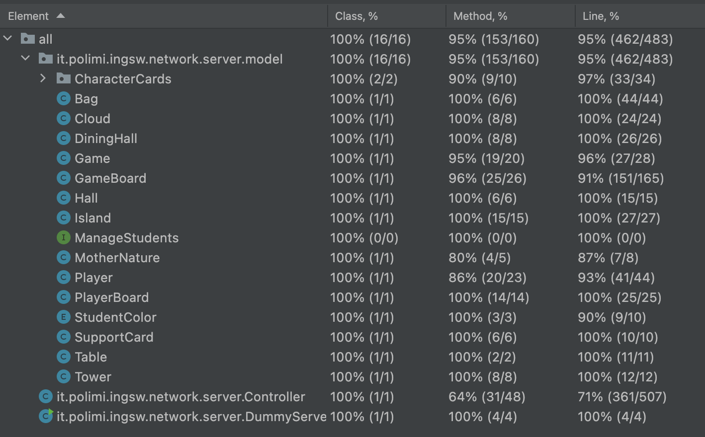

# PROGETTO INGEGNERIA DEL SOFTWARE 2022

---

### Group AM49

| Name      | Surname     | Email                           |
|:----------|:------------|:--------------------------------|
| Emanuele  | Banfi       | emanuele1.banfi@mail.polimi.it  |
| Lucio     | Bencardino  | lucio.bencardino@mail.polimi.it |
| Adriano   | Fazzo       | adriano.fazzo@mail.polimi.it    |

---

### Implemented functionality

| Functionality                    | Status |
|:---------------------------------|:------:|
| Basic rules                      |   ✅    |
| Complete rules                   |   ✅    |
| Socket                           |   ✅    |
| GUI                              |   ✅    |
| CLI                              |   ✅    |
| All character cards              |   ✅    |
| Multiplayer: for up to 4 players |   ✅    |
| Multiple games                   |   ⛔️   |
| Persistence                      |   ⛔️   |
| Resilience to disconnections     |   ⛔️   |

⛔️ Not Implemented &nbsp;&nbsp;&nbsp;&nbsp;⚠️ Implementing &nbsp;&nbsp;&nbsp;&nbsp;✅ Implemented

---

### Test coverage

The screenshot show the coverage of our code. For the coverage they were considered all the model classes and the controller class.



---

### Executing the jar file

There is a unique jar for the server and the client (CLI and GUI interface).
To launch the jar the input in the terminal must be:

```bash
java -jar Eriantys.jar
```

